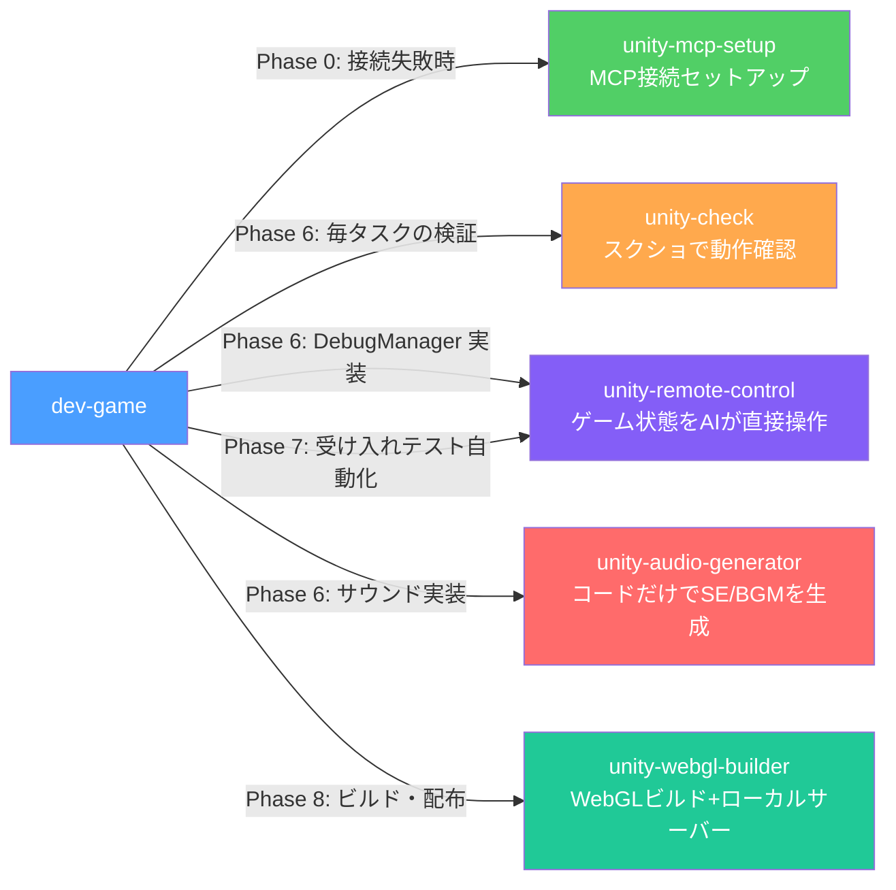

# hcg-workflows

Unity ハイパーカジュアルゲームを Claude Code + Unity MCP で開発するためのスキル集です。

## 使い方

1. このリポジトリをクローンまたはダウンロード
2. 各スキルフォルダを `.claude/skills/` にコピー
3. Unity MCP をセットアップ（`unity-mcp-setup` スキル参照）
4. `/dev-game` を実行し、エージェントの質問に回答していく

## 全体フロー

## スキル一覧

| スキル | 説明 |
|--------|------|
| [dev-game](dev-game/) | 仕様駆動開発（SDD）でゲームを作る。企画書→仕様書→タスクリスト→実装→テスト→リリースまで一貫して管理 |
| [unity-mcp-setup](unity-mcp-setup/) | Unity Editor と Claude Code の MCP 接続をセットアップ |
| [unity-check](unity-check/) | コンパイル確認・Play Mode 動作確認・スクリーンショット検証の 3 段階で実装を検証 |
| [unity-remote-control](unity-remote-control/) | DebugManager + McpRemoteControl でゲーム状態を AI が直接操作。受け入れテストを自動化 |
| [unity-audio-generator](unity-audio-generator/) | C# Editor スクリプトで SE・BGM を生成。外部ツール不要 |
| [unity-webgl-builder](unity-webgl-builder/) | WebGL ビルドとローカルサーバー起動を自動化 |

## 前提条件

- Unity Editor（2022.3 LTS 以降推奨）
- [MCP For Unity](https://github.com/nicknisi/unity-mcp) がインストール済み
- Claude Code
