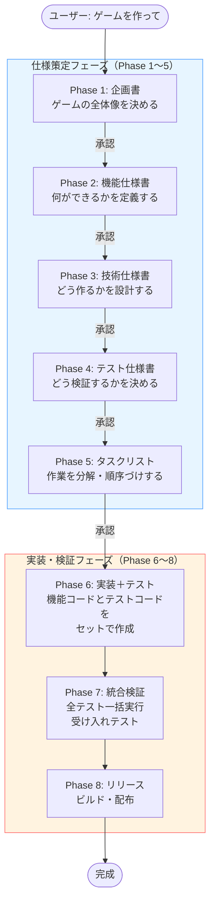
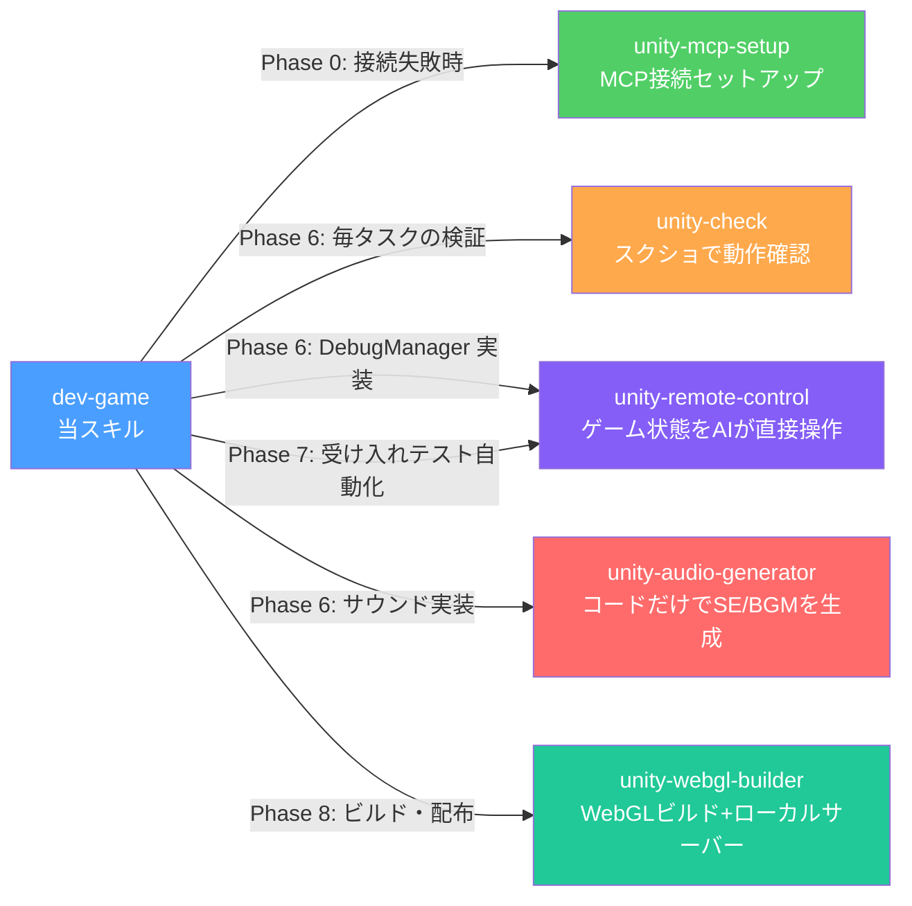
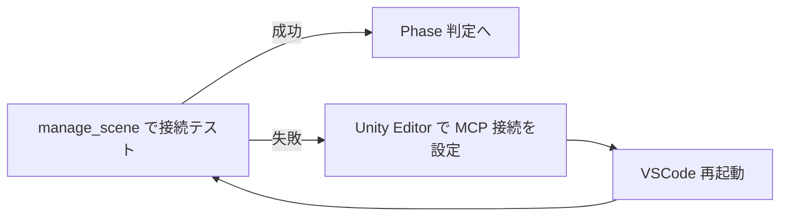
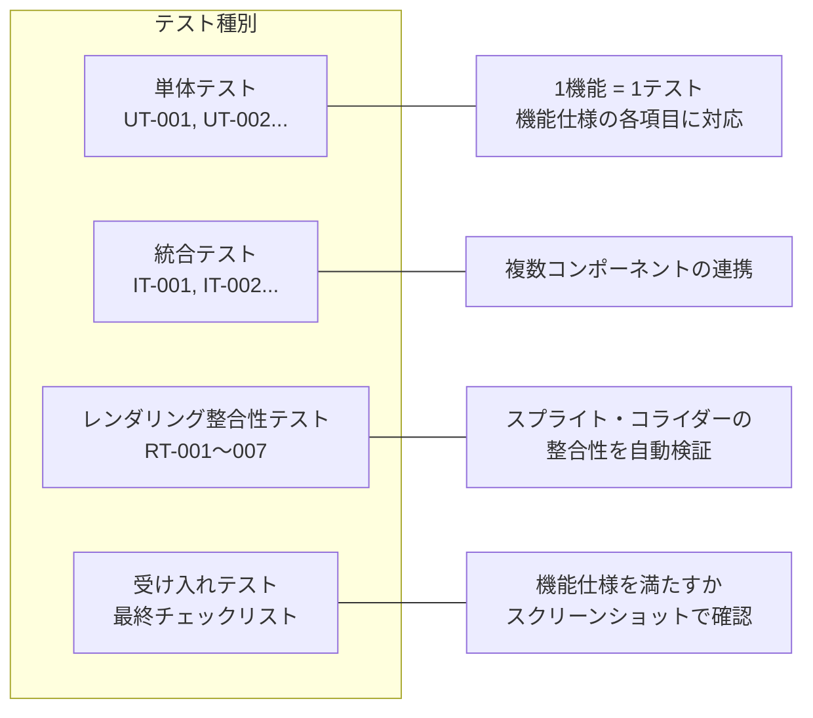
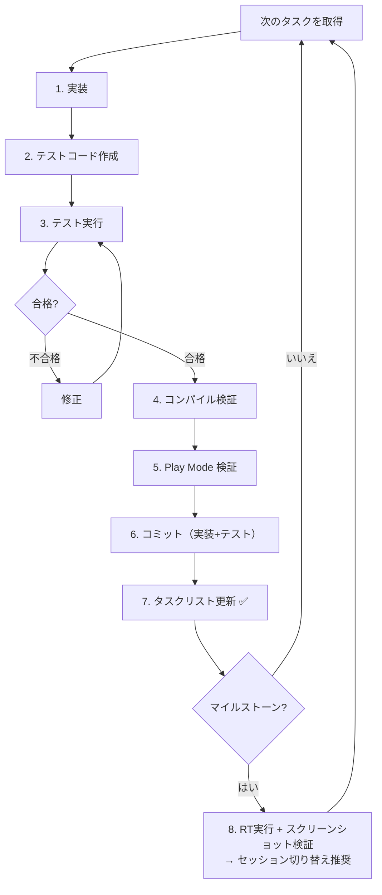
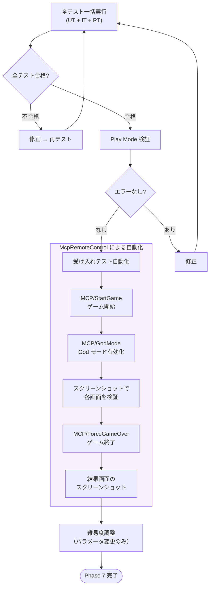

# dev-game — ガイド

## このスキルは何？

Unity ハイパーカジュアルゲームを「仕様駆動開発（SDD）」で作るワークフローです。

**仕様駆動開発とは**: 先にドキュメント（仕様書）を完成させ、そのドキュメントに基づいてコードを書き、テストで検証する開発手法です。「作りながら考える」のではなく「考えてから作る」ことで、手戻り（作り直し）を最小化します。

全体は **Phase 0〜8** の 9 ステップで構成されています。

---

## 全体フロー



---

## 関連スキルとの連携



---

## Phase 0: Unity MCP 接続確認

**目的**: Claude Code が Unity Editor を操作できる状態か確認する。

Unity MCP は Claude Code と Unity Editor をつなぐ通信路です。これがないと、シーンの操作・スクリプト作成・テスト実行などが一切できません。



---

## Phase 1: ゲーム企画書

**目的**: ゲームの全体像を 1 ページで共有する。

ここで決めること:
- タイトル、ジャンル、コンセプト（1行で言えるゲームの魅力）
- コアループ（プレイヤーが繰り返す行動）
- 勝利・敗北条件
- ターゲットプラットフォーム

**成果物**: `docs/01-game-design.md`

> ユーザーと対話しながら内容を詰め、承認を得てからコミット → 次の Phase へ。

---

## Phase 2: 機能仕様書

**目的**: ゲームが「何をするか」を漏れなく定義する。

企画書を元に、以下を具体化します:

| 項目 | 内容 |
|------|------|
| 画面一覧・遷移図 | どの画面があり、どう行き来するか |
| ゲームメカニクス | 入力 → 処理 → 出力 → 境界条件 |
| スコア・難易度 | 計算式、難易度曲線、パラメータ |
| UI/UX | レイアウト、演出、フィードバック |

**成果物**: `docs/02-functional-spec.md`

---

## Phase 3: 技術仕様書

**目的**: 機能仕様を「どう実現するか」を設計する。

| 項目 | 内容 |
|------|------|
| フォルダ構成 | Scripts/Core, Gameplay, UI などの配置 |
| クラス設計 | クラス名・責務・依存関係・主要メソッド |
| 状態遷移 | Init → Title → Playing → GameOver → Result |
| データ設計 | 保存データ、ScriptableObject、PlayerPrefs |

**成果物**: `docs/03-technical-spec.md`

---

## Phase 4: テスト仕様書

**目的**: 実装前に「何をテストするか」を決める。これが仕様駆動の要。

テスト仕様書はテスト「コード」ではなく、テスト「ケースの定義」です。
テストコードの実装は Phase 6 で各タスクの機能コードとセットで行います。



**成果物**: `docs/04-test-spec.md`

---

## Phase 5: タスクリスト

**目的**: 仕様書をタスクに分解し、実装の順序と依存関係を明確にする。

各タスクには以下が紐づきます:

- **タスクID** (例: `TASK-001`, `TASK-002`)
- **対応テストID** (例: `UT-001`) — Phase 6 でこのテストのコードも一緒に書く
- **テスト結果** — 実装・テスト完了後に PASS を記録
- **依存タスク** (例: `TASK-001` が完了しないと `TASK-003` に着手できない)
- **ステータス** (`🔲未着手` → `🔧作業中` → `✅完了`)

### マイルストーンタスク

各フェーズの末尾にスクリーンショット検証のマイルストーンタスク（`TASK-M1`, `TASK-M2`, ...）を配置します。**マイルストーンは次フェーズへのゲートであり、完了しないと後続フェーズに進めません。**

```
例:
### フェーズ3: コアメカニクス
| ✅ | TASK-020 | ... |
| 🔲 | TASK-M1  | マイルストーン1: スクリーンショット検証 | ← これが完了しないと↓に進めない

### フェーズ4: スコアシステム
| 🔲 | TASK-021 | スコア加算ロジック | 依存: TASK-M1 |
```

**成果物**: `docs/05-task-list.md`

---

## コミットルール早見表

| フェーズ | 粒度 | メッセージ例 |
|----------|------|-------------|
| Phase 1〜5 | Phase ごとに 1 コミット | `Phase 2: 機能仕様書を追加` |
| Phase 6 | タスクごとに 1 コミット | `Task 6-1: PlayerController を実装・テスト追加 (UT-001 PASS)` |
| Phase 7 | 検証種別ごとに 1 コミット | `Phase 7: 受け入れテストを完了` |
| Phase 8 | Phase ごとに 1 コミット | `Phase 8: WebGL ビルド設定を完了` |
| バグ修正 | 修正ごとに 1 コミット | `Fix: 重力反転時の判定を修正` |

- コミット前に必ず Play Mode 検証を実行し、エラーがないことを確認する
- **テストIDがコミットメッセージにある = テストが合格済み** — テスト未実行のまま PASS を記載しない

---

## Phase 6: 実装＋テスト

**目的**: タスクリストに沿って Unity MCP でゲームを組み立てる。機能コードとテストコードをセットで作成する。

### 1タスクの実装サイクル



### 実装の原則

- **仕様書にない機能は作らない**
- **パラメータはハードコードしない** — ScriptableObject または定数クラスで管理
- **バグ発見時は即起票** — `TASK-FIX-{連番}` でタスクリストに追加し、Phase 7 前に完了させる
- **仕様変更は仕様書が先** — 仕様の不備を発見したら、仕様書 → 実装 → テストの順で更新する

### 推奨する実装順序

```
1. プロジェクト構成 → 2. GameManager + DebugManager → 3. コアメカニクス
→ 4. スコア → 5. UI → 6. 演出 → 7. サウンド → 8. データ保存
```

GameManager 完成直後に **DebugManager + McpRemoteControl** を実装する（Phase 7 の受け入れテスト自動化に必要）。

---

## Phase 7: 統合検証・受け入れテスト

**目的**: 全テストを一括実行し、受け入れテストでゲームの品質を保証する。



### McpRemoteControl による受け入れテスト自動化

Phase 6 で実装した DebugManager + McpRemoteControl を使い、人手なしで受け入れテストを実行します。ゲーム開始・God モード有効化・画面遷移・ゲームオーバーなどを MCP から直接制御し、各画面をスクリーンショットで検証します。詳細は **unity-remote-control スキル** を参照。

---

## Phase 8: リリース

**目的**: ビルドして配布する。

1. ビルド設定確認（解像度、プラットフォーム固有設定）
2. ビルド実行・動作確認
3. 配布（WebGL → itch.io / GitHub Pages など）

